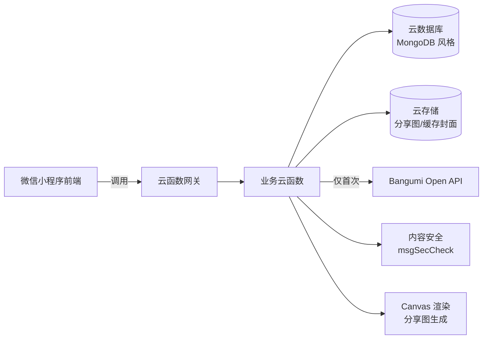

# GameNine
🎮 我的游戏清单小程序 - 记录玩过、在玩、想玩的游戏，生成分享图
# GameNine · 我的游戏清单小程序

> 一个基于 Bangumi 开放数据的微信小程序，帮你记录玩过、在玩、想玩的游戏，
> 并把你的游戏品味生成一张可以发朋友圈的分享图。

灵感来源：[my9.shatranj.space](https://my9.shatranj.space)（由苍旻白轮开发的"构成我的九部"）
数据来源：[Bangumi 番组计划](https://bgm.tv)

---

## ✨ 核心理念

GameNine 不是游戏商店，也不是游戏论坛，而是一款**私人向的游戏记录工具**：

- **记录是地基**：你玩过的每一款游戏都值得被留下痕迹。
- **清单是表达**：把你的游戏品味整理成一份份主题清单。
- **分享是仪式**：一键生成精美长图，让朋友一眼看懂你是什么样的玩家。

我们刻意**不做**的事：
- 不做游戏下载与交易
- 不做开放式评论区与论坛
- 不做新游发售推送与任何打扰式通知
- 不做算法信息流

---

## 🎯 功能概览

### 一、游戏库（核心）

- 四种标记状态：**想玩 / 在玩 / 玩过 / 搁置**
- 5 星评分 + 140 字短评
- 可选记录：开始日期、通关日期、游玩平台、游玩时长
- 隐私分级：每条记录可独立设置公开 / 仅自己可见
- 支持从 Bangumi 搜索游戏并一键添加（支持中日英多语匹配）

### 二、清单（特色）

- **九宫格清单**：致敬 my9，选出 9 部代表作
- **主题清单**：自定义标题，如「我玩过最好的 5 款 RPG」「2025 年度私人 Top 10」
- **智能清单**：根据你的游戏库自动生成（最高分 Top、最常玩平台、最爱类型等）
- 所有清单均可**一键导出为竖版长图**，附带个人小程序码

### 三、工具（传播）

-  九宫格生成器（多种背景主题、字体、排版）
- 📊 个人游戏名片（总游戏数 / 平均分 / 类型雷达图）
- 📈 年度游戏报告（每年 12 月解锁，基于用户自身数据生成）
- 🏅 成就徽章（玩过 10/50/100 款、通关某系列等收集向玩法）

### 四、发现（轻量）

仅作为「找到想记录的游戏」入口，**不做信息流**：

- 按平台筛选（Steam / Switch / PS5 / Xbox / 手游 / 其他）
- 按类型筛选（RPG / 肉鸽 / 模拟经营 / 恋爱 / ……）
- Bangumi 高分榜（只读展示）

---

## 🏗 技术架构

### 技术选型

| 层级 | 选型 | 说明 |
|---|---|---|
| 前端 | 微信原生小程序 + TypeScript | 后续可评估迁移 Taro |
| UI 组件 | TDesign / Vant Weapp | 任选其一 |
| 后端 | 微信云开发（CloudBase） | 云函数 + 云数据库 + 云存储 |
| 数据源 | Bangumi Open API | 游戏元数据唯一来源 |
| 图片合成 | 云函数 + `@napi-rs/canvas` | 统一在服务端渲染分享图 |
| 缓存 | 云数据库 + 腾讯云 Redis（可选） | 减少 Bangumi API 调用 |

### 架构图



### 数据库设计（核心集合）

```js
// 用户
users: {
  _id, openid, nickname, avatar, bio,
  defaultPrivacy,   // 'public' | 'private'
  createdAt
}

// 游戏元数据缓存（全局共享）
games_cache: {
  _id, bgmId, title, titleCN, titleAlias[],
  cover, summary, platforms[], tags[],
  avgRating, releaseDate, cachedAt
}

// 用户 × 游戏 关联记录（核心业务表）
user_games: {
  _id, openid, bgmId,
tatus,           // 'wish' | 'playing' | 'done' | 'shelved'
  rating,           // 1-10，对应 0.5-5 星
  comment,          // ≤140 字
  platform, playTime, startDate, finishDate,
  isPublic,
  updatedAt
}

// 清单
lists: {
  _id, openid, title, description, coverStyle,
  games[],          // [{ bgmId, order, note }]
  isPublic, createdAt, updatedAt
}

// 分享卡片（生成图的元信息）
hare_cards: {
  _id, cardId, openid,
  type,             // 'nine' | 'list' | 'profile' | 'yearly'
napshot,         // 生成时的数据快照
  imageUrl, style,
  viewCount, createdAt
}

// 用户统计（每日重算）
user_stats: {
  _id, openid,
  totalGames, avgRating,
  genreDistribution, platformDistribution,
  yearlyStats, lastComputedAt
}
```

### 关键索引

- `user_games`: `{openid, status}` / `{openid, bgmId}` / `{openid, updatedAt}`
- `games_cache`: `{bgmId}` 唯一索引
- `lists`: `{openid, updatedAt}`

---

## 🧩 主要流程

### 标记一款游戏

```mermaid
equenceDiagram
    用户->>小程序：搜索关键词
    小程序->>云函数：search(keyword)
    云函数->>games_cache: 查本地缓存
    alt 命中缓存
        games_cache-->>云函数：游戏列表
    else 未命中
        云函数->>Bangumi: /v0/search/subjects
        Bangumi-->>云函数：游戏列表
        云函数->>games_cache: 写回缓存
    end
    云函数-->>小程序：返回候选列表
    用户->>小程序：点击「玩过」+ 5 星
    小程序->>云函数：markGame(bgmId, status, rating)
    云函数->>内容安全：校验短评
    云函数->>user_games: upsert
    云函数-->>小程序：成功
```

### 生成九宫格分享图

1. 用户在「工具 - 九宫格」中从自己的游戏库选择 9 款游戏
2. 选择样式模板（背景、字体、排版）
3. 云函数使用 Canvas 将 9 款游戏封面 + 标题 + 小程序码合成为竖版长图
4. 图片存入云存储，返回临时 URL
5. 用户保存到相册，手动分享至朋友圈 / 小红书 / 微博

---

## 🗺 开发路线图

### MVP（v0.1，预计 4–6 周）
- [ ] 微信登录与用户体系
- [ ] Bangumi 游戏搜索 + 本地缓存
- [ ] 四状态标记 / 评分 / 短评
- [ ] 我的游戏库（四个状态 Tab）
- [ ] 九宫格生成器 + 分享长图
- [ ] 个人主页简版
- [ ] 隐私分级与内容安全

### v0.2（上线后 1–2 个月）
- [ ] 主题清单（自定义标题 + 选游戏 + 生成图）
- [ ] 游戏详情页（含自己的历史记录）
- [ ] 发现 Tab：平台 / 类型筛选、Bangumi 高分榜
- [ ] 数据一键导出（JSON / CSV）

### v0.3（3–4 个月）
- [ ] 个人游戏名片（统计雷达图）
- [ ] 智能清单（自动生成）
- [ ] 年度游戏报告（结合年末节点）
- [ ] 成就徽章系统

### 远期（待定）
- 社区功能（关注 / 好友动态 / 聚合短评）在 DAU 达到一定规模后再评估
- Steam 库导入、多平台映射

---

## 📜 合规与数据来源

- 游戏元数据来自 [Bangumi 番组计划](https://bgm.tv)，所有游戏详情页均保留「数据来源：Bangumi」署名与跳转链接
- 封面图采用 URL 引用而非复制存储，尊重原始版权
- 所有用户生成内容（昵称、简介、短评、清单标题、上传图片）均接入微信 `msgSecCheck` / `imgSecCheck` 内容安全接口
- 小程序类目计划申请「工具」或「社交 - 笔记」，不涉及游戏分发

---

## 🛠 本地开发

> 以下命令假设你已安装微信开发者工具与 Node.js ≥ 18。

```bash
# 克隆仓库
git clone https://github.com/yourname/gamenine.git
cd gamenine

# 安装小程序端依赖
cd miniprogram && npm install

# 安装云函数依赖
cd ../cloudfunctions && npm install

# 使用微信开发者工具打开项目根目录
# 在 project.config.json 中替换 appid
```

环境变量（在云函数控制台配置）：

```
BGM_USER_AGENT=yourname/gamenine (https://github.com/yourname/gamenine)
REDIS_URL=（可选）
```

---

## 🤝 贡献

欢迎提交 Issue 与 PR。在参与前请阅读 [CONTRIBUTING.md](./CONTRIBUTING.md)（待补充）。

---

## 📄 License

MIT © 2026 GameNine Contributors

本项目使用 Bangumi 开放数据，数据版权归 Bangumi 及对应条目的原始来源所有。


